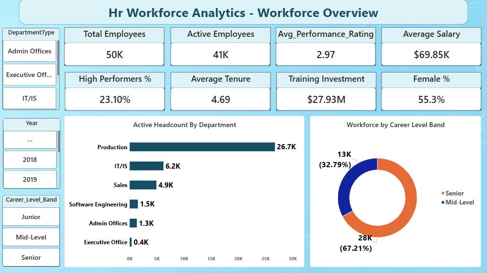
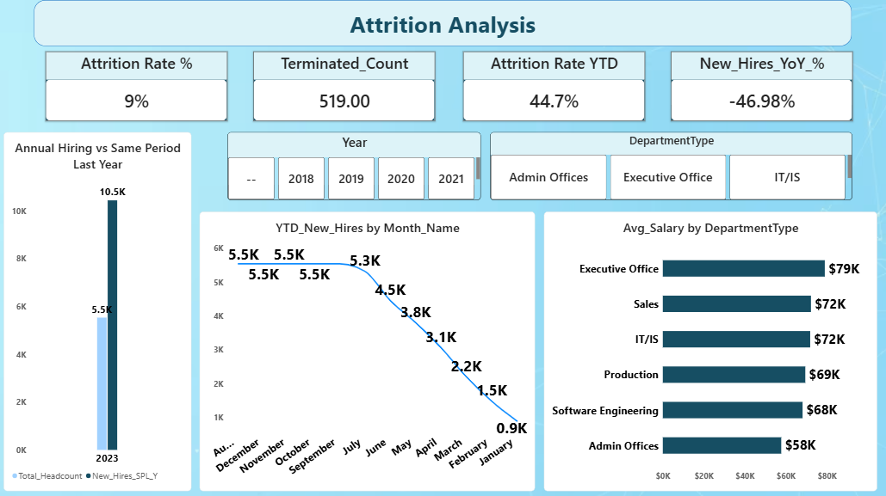
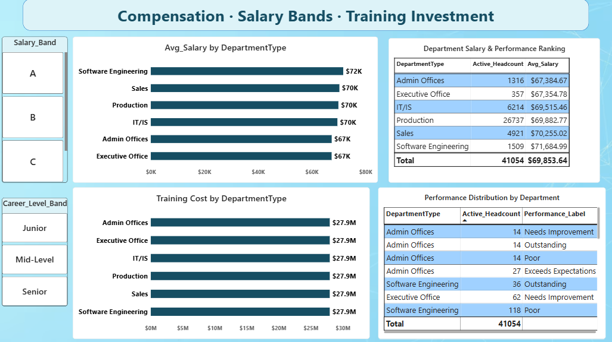

# 📊 HR Workforce Analytics – Power BI Dashboard

## 📌 Project Overview

**HR Workforce Analytics** is an interactive Power BI dashboard designed to provide a comprehensive view of an organization's workforce, employee attrition, compensation, career levels, performance, and training investment.

The dashboard transforms HR data into meaningful KPIs and visual insights that help understand **workforce composition, employee retention, hiring trends, salary distribution, employee performance, and departmental workforce patterns**.

The project consists of **three interactive dashboard pages**:

1. **Workforce Overview**
2. **Attrition Analysis**
3. **Compensation • Salary Bands • Training Investment**

---

## 🎯 Project Objectives

The main objectives of this project are to:

* Analyze the overall workforce size and active employees.
* Monitor employee attrition and termination trends.
* Analyze hiring patterns and year-over-year changes.
* Compare employee performance across departments.
* Analyze average salary by department.
* Understand workforce distribution across career levels.
* Analyze salary bands and compensation patterns.
* Evaluate training investment across departments.
* Provide interactive HR insights using Power BI slicers and visualizations.

---

# 📑 Dashboard Pages

## 1️⃣ Workforce Overview

The **Workforce Overview** page provides a high-level summary of the organization's employees and workforce structure.

### 🔑 Key KPIs

* **Total Employees:** 50K
* **Active Employees:** 41K
* **Average Performance Rating:** 2.97
* **Average Salary:** $69.85K
* **High Performers:** 23.10%
* **Average Tenure:** 4.69
* **Training Investment:** $27.93M
* **Female Employees:** 55.3%

### 📊 Visualizations

* Active Headcount by Department
* Workforce Distribution by Career Level
* Department Type slicer
* Year slicer
* Career Level Band slicer

### 🔍 Key Insight

Production represents the largest active workforce, while the workforce is predominantly composed of **Senior and Mid-Level employees**.

### 🖼️ Dashboard Preview



---

# 2️⃣ Attrition Analysis

The **Attrition Analysis** page focuses on employee turnover, hiring activity, and year-to-date workforce trends.

### 🔑 Key KPIs

* **Attrition Rate:** 9%
* **Terminated Employees:** 519
* **Attrition Rate YTD:** 44.7%
* **New Hires YoY:** -46.98%

### 📊 Visualizations

* Annual Hiring vs Same Period Last Year
* YTD New Hires by Month
* Average Salary by Department
* Year slicer
* Department Type slicer

### 🔍 Key Insight

The page enables HR teams to identify changes in hiring activity, monitor attrition, and compare workforce trends across different departments and periods.

### 🖼️ Dashboard Preview



---

# 3️⃣ Compensation • Salary Bands • Training Investment

The third page focuses on employee compensation, salary bands, departmental performance, and training investment.

### 📊 Visualizations

* Average Salary by Department
* Department Salary & Performance Ranking
* Training Cost by Department
* Performance Distribution by Department
* Salary Band slicer
* Career Level Band slicer

### 🔍 Key Analysis Areas

**Compensation Analysis**

* Compare average salary across departments.
* Identify departments with higher and lower average compensation.
* Analyze salary patterns using salary bands.

**Performance Analysis**

* Analyze employee performance categories.
* Compare performance distribution across departments.
* Identify performance labels such as Outstanding, Exceeds Expectations, Needs Improvement, and Poor.

**Training Investment**

* Analyze training investment across departments.
* Compare departmental training costs.

### 🖼️ Dashboard Preview



---

# 📈 Key Metrics & HR Indicators

| Metric              | Purpose                                                    |
| ------------------- | ---------------------------------------------------------- |
| Total Employees     | Measures overall workforce size                            |
| Active Employees    | Measures current active workforce                          |
| Attrition Rate      | Tracks employee turnover                                   |
| Terminated Count    | Measures employee exits                                    |
| Attrition Rate YTD  | Monitors year-to-date attrition                            |
| New Hires YoY %     | Compares hiring with the previous year                     |
| Average Salary      | Measures average employee compensation                     |
| Average Tenure      | Measures employee experience/retention                     |
| Performance Rating  | Evaluates workforce performance                            |
| High Performers %   | Measures proportion of high-performing employees           |
| Female %            | Shows workforce gender representation                      |
| Training Investment | Measures organizational investment in employee development |

---

# 🎛️ Interactive Features

The dashboard includes multiple slicers that allow users to dynamically explore HR data.

### Available Filters

* **Year**
* **Department Type**
* **Career Level Band**
* **Salary Band**

Users can combine different filters to perform focused analysis of specific employee groups, departments, career levels, and periods.

---

# 🛠️ Tools & Technologies

* **Microsoft Power BI**
* **Power Query**
* **DAX**
* **Data Modeling**
* **Interactive Data Visualization**
* **Star Schema / Date Dimension**
* **KPI & Performance Analysis**

---

# 🧮 DAX & Analytical Concepts

The dashboard uses Power BI analytical concepts such as:

* KPI Measures
* Aggregations
* Average calculations
* Employee headcount calculations
* Attrition rate calculations
* Year-to-Date calculations
* Year-over-Year analysis
* Department-level analysis
* Performance classification
* Salary analysis
* Time-intelligence calculations
* Interactive filter context

---

# 🎨 Dashboard Design

The dashboard follows a professional HR analytics theme featuring:

* Clean executive-style layout
* Consistent blue color palette
* KPI cards for quick decision-making
* Horizontal bar charts for departmental comparisons
* Donut chart for workforce composition
* Line chart for hiring trends
* Interactive slicers
* Summary tables for detailed analysis

The design focuses on making important HR metrics easy to understand for **HR managers, business analysts, and decision-makers**.

---

# 💡 Business Questions Answered

This dashboard helps answer questions such as:

* How many employees are currently active?
* Which department has the highest workforce?
* What is the organization's overall attrition rate?
* How many employees have been terminated?
* How is hiring changing compared with the previous year?
* Which department has the highest average salary?
* How is the workforce distributed across career levels?
* What percentage of employees are high performers?
* Which departments have different performance distributions?
* How much is being invested in employee training?
* How does salary vary across departments and salary bands?
* How does workforce composition change over time?

---

# 📂 Repository Structure

```text
HR-Workforce-Analytics/
│
├── HR_Workforce_Analytics.pbix
│
├── Dashboard/
│   ├── Workforce_Overview.png
│   ├── Attrition_Analysis.png
│   └── Compensation_Salary_Training.png
│
├── Dataset/
│   └── HR_Workforce_Data.csv
│
└── README.md
```

> **Note:** Update the dataset filename in the structure above according to the actual dataset used in your Power BI project.

---

# 🚀 How to Use

1. Download or clone this repository.
2. Open `HR_Workforce_Analytics.pbix` using **Microsoft Power BI Desktop**.
3. If required, update the dataset/data-source path.
4. Refresh the data.
5. Use the available slicers to interact with the dashboard.
6. Explore workforce, attrition, compensation, performance, and training insights.

---

# 🎯 Project Outcome

This project demonstrates how **Power BI, DAX, data modeling, and interactive visualization** can be used to convert HR workforce data into an executive-level analytics solution.

The dashboard provides a centralized view of:

**Workforce → Attrition → Hiring → Compensation → Performance → Training**

This makes it easier for HR teams and business stakeholders to monitor workforce trends and support **data-driven decision-making**.

---

## 👩‍💻 Author

**Mansi Pawar**

BCA Student | Power BI | Data Analytics | SQL | Python

---

⭐ **If you find this project useful, consider giving the repository a star!**
